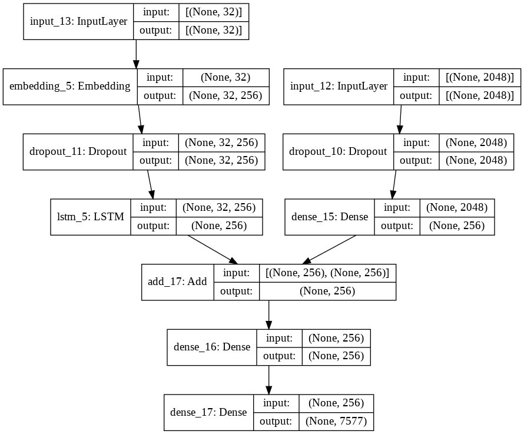

# Image Caption Generator

This is a Deep learning project using Flickr8k dataset for CSE 475: Machine Learning

# FAQ

## How can I run this project?

1.  Download and extract [Flickr8k_Dataset.zip](https://drive.google.com/file/d/1Y37dUIocd2hjADk7FmMP-ptmzAssFQcN/view?usp=sharing) and [Flickr8k_text.zip](https://drive.google.com/file/d/179RcanAzTFNXguIboXn2ZI1hx7tWKk16/view?usp=sharing)

2.  Now, create a folder named 'ML' in root directory of your Google Drive.

3.  Then upload extracted version of `Flickr8k_Dataset` and `Flickr8k_text` into the ML folder. This will take times depending on your IP provider.

4.  Also upload the `testing_caption_generator.py` into ML folder.

5.  Now create a notebook in Colab by your preferred name, and copy paste from `ImageCaption.ipynb`

6.  Run all the shells. Happy CODING :)

## VISUAL REPRESENTATION OF MODEL

## YOUTUBE DEMONSTRATION

